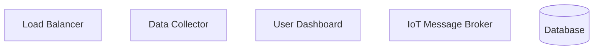
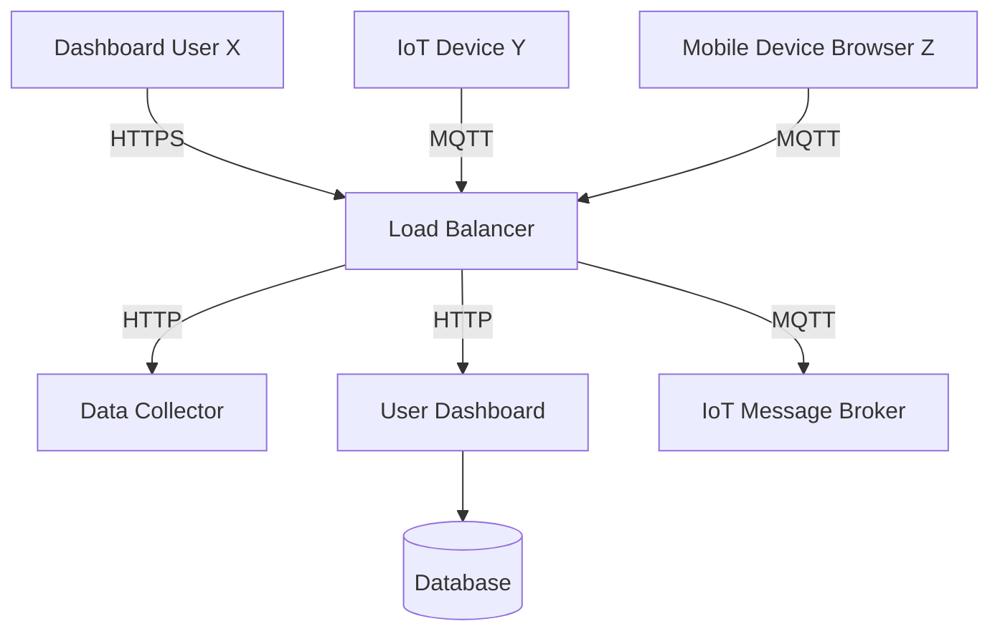
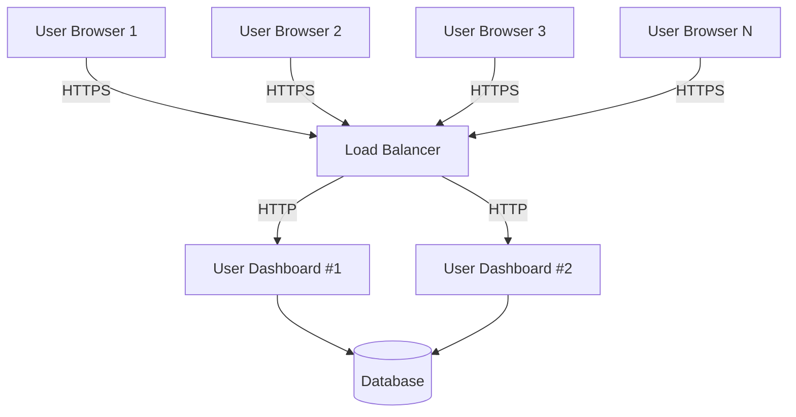
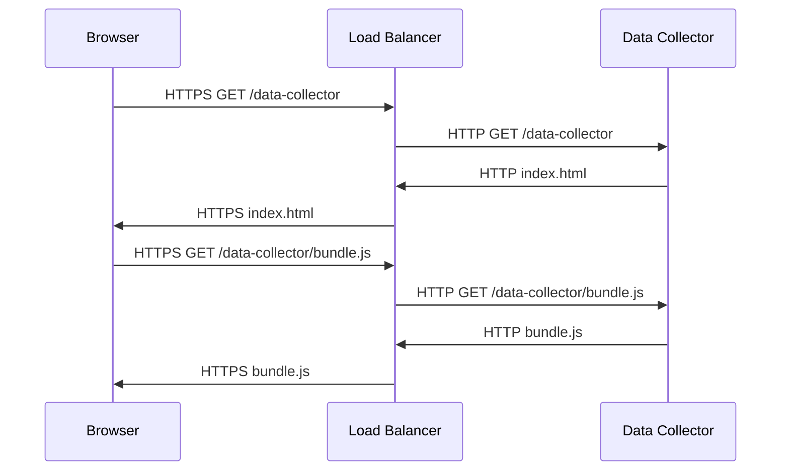
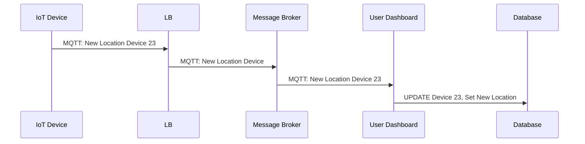
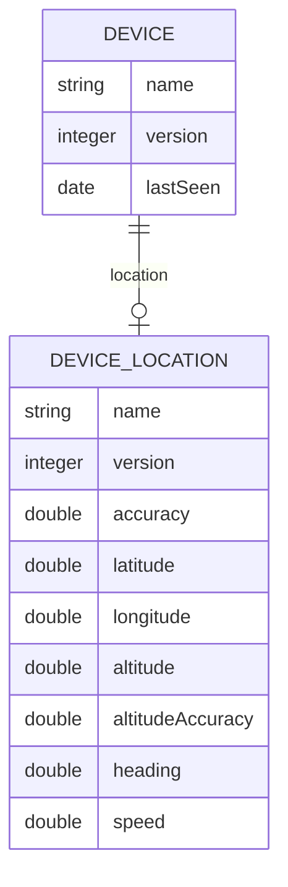
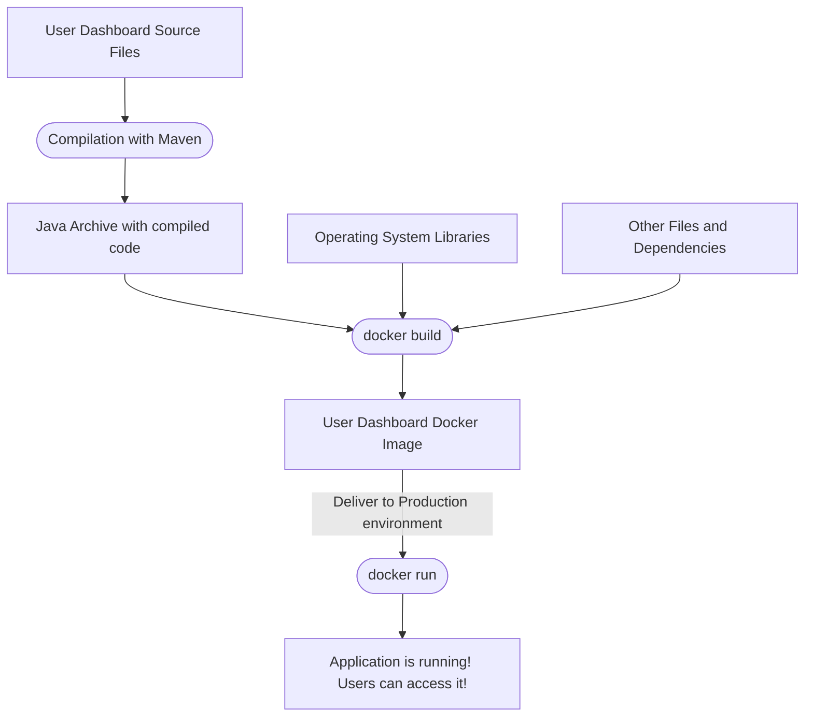
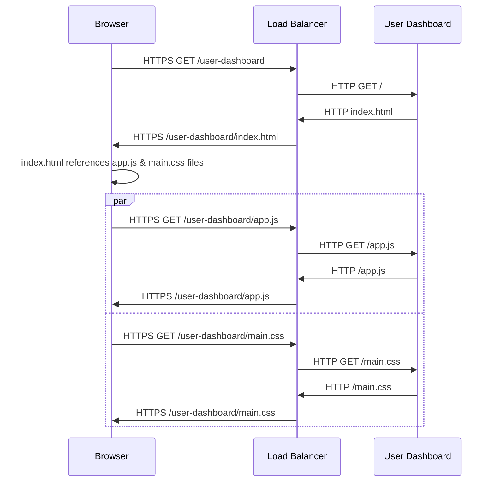
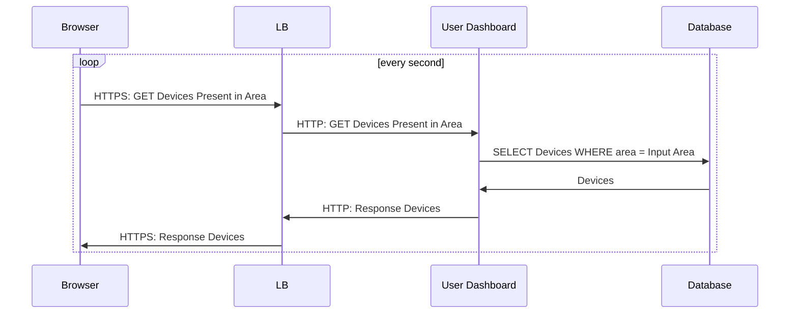
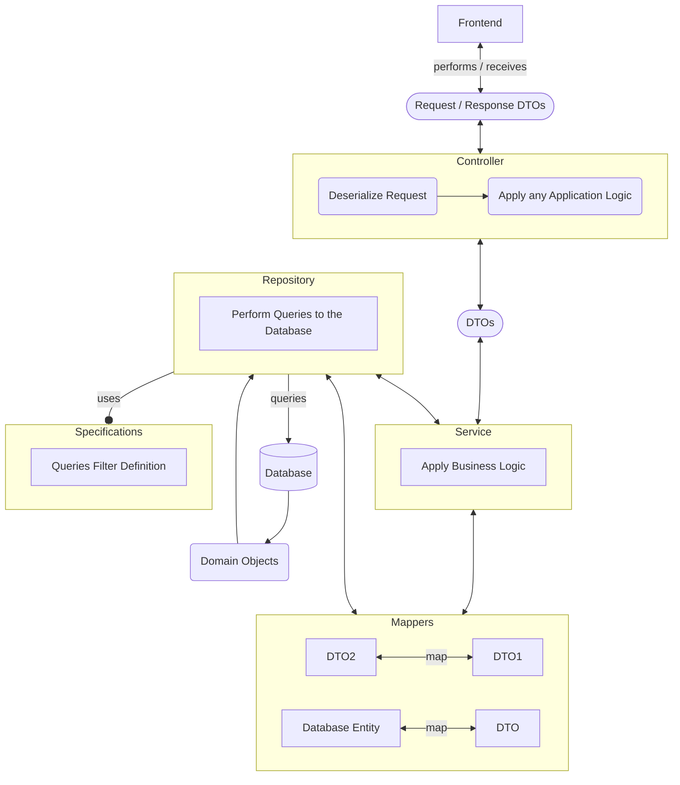

# Workshop IoT Network

## Requirements

- Java 11
- Docker and Docker Compose
- npm
- git
- Visual Studio Code
- Google Chrome (specifically)
- DBeaver or any other tool to connect to a Database

To assert that everything needed is present in your system, you can start the application by following the instructions present in [Starting the Application](#starting-the-application)

## Introduction

Welcome to `iot.network`! We are leaders on collecting and processing geolocation data of Mobile and IoT Devices, and you are our most recent Software Engineer. Congratulations on your new job!

As with all new jobs, you may feel kinda lost... Don't worry! Today we will be diving into the details our application. This is our agenda:

- Firstly, we will give you an overview of the application architecture
- Next, we will dive into the role of each one of the services present in the architecture
- The way we compile and orchestrate the infrastructure with docker compose is also going to be seen
- Since the User Dashboard is going to be the subject of most of your work, we are going to detail a little bit more of its architecture
- Finally, Our Product Owner has a new feature to be implemented. That's your challenge for the day, to implement it end to end!

## Application Overview

### Summary

`iot.network` is a hub for devices geolocation. The application receives geolocation data from registered devices and displays said locations in the user's internal dashboard, where users can then check its locations. User's can also connect to `iot.network` via their Mobile Devices (like phones, laptops, or anything with a Browser really) in order to share their geolocation.

The application is composed of 5 different services.



Next we will dive into the details of each one of these services, but for now we want you to have a general view of each one:

- The Load Balancer is the front door for all our infrastructure and is the first service users connect to in order to access our application.
- The Data Collector is a React.js application used retrieve the geolocation of Mobile Devices via Browser.
- The User Dashboard is a Java application that will process the geolocation of the Mobile and IoT Devices, saving it to the database. It also serves the User Dashboard, where users can see the location of all their devices.
- The Database is our persistent layer where the data about the devices is saved.
- The IoT Message Broker is the service to where all the devices will send their information. That information is then read by the User Dashboard and saved to the Database.

Today you will get to play with some of these!

### Starting the Application

Before proceeding, you must take a look at our product! To do that:

- Start by cloning this repository
- Change directory to the root of the repository
- Run `make all start`
- Open your browser and access https://localhost:8443/user-dashboard, where you will get to see an empty map.
- On another window or tab, access https://localhost:8443/data-collector. Register yourself to start sharing your location.
- Go back to the User Dashboard. You should now see a new marker on the map: your device is connected and sharing its location!

## About each service

### Load Balancer

The Load Balancer (LB) is the gateway our application and, even though it may be considered an optional component, it serves important purposes in our application.

As the gateway, the Load Balancer sits in front of our all internal application services, the ones we previously mentioned. All our users and their devices connect to our application through the LB, and the purpose of the LB is to forward those connections and requests to the appropriate internal service. This is also usually called a Reverse Proxy.

Let's try to visualize this:



So, when a user accesses our application via a browser, in fact all its requests are received firstly by the Load Balancer and then forwarded to the proper service:

- Requests to the User Dashboard are served via HTTPS. Similarly, the Data Collector application is served via HTTPS. Accordingly to the URL of the request, the Load Balancer will decide on whether to forward the request to the Data Collector or to the User Dashboard services. For example, if the URL is:
  - https://localhost:8443/data-collector, then the request will be forwarded to the Data Collector
  - https://localhost:8443/user-dashboard, then the request will be forwarded to the User Dashboard
- While present in the Data Collector page, the Mobile Devices will continually share their geolocation. This is done via the MQTT protocol over WSS. These requests are forwarded to the IoT Message Broker.
- The IoT devices use the MQTT protocol to share their geolocation. All these requests will also be forwarded to the IoT Message Broker.

Another purpose of a Load Balancer can also be inferred from its name: to balance load between services. Imagine a scenario where you have lot users accessing our web application and, in particular the User Dashboard. So many that our User Dashboard is having an hard time responding to all the requests. To tackle this issue we can opt to scale our User Dashboard horizontally in an effort to be able to respond to all requests, by adding a new instance. Under that scenario, our Load Balancer will be responsible to split the load between those two instances of the User Dashboard service:



As many other web applications, `iot.network` uses a Secure Socket Layer (SSL) to secure the communication between the user's browser to our servers. This way we can guarantee that there's an encrypted connection between the browser and the Load Balancer.

We use NGINX as our Load Balancer/Reverse Proxy, and you can get more details about the rules we have configured on the [proxy.conf](nginx/proxy.conf) file.

### Data Collector

The Data Collector is one of the applications that compose the frontend of `iot.network`. It is a Web Application written in React.js, a popular JavaScript Framework. Once compiled, the application is composed by nothing more then a bunch of HTML (`.html`), JavaScript (`.js`) and CSS (`.css`) files. Like any standard web application, the Browser that the user uses to access our application is the one that runs our application. It grabs all theses `html`, `js` and `css` files, and is capable of interpreting them in order to render our User Interface.

To serve the `html`, `js` and `css` files to the browser, we use the Data Collector service present in our infrastructure. This service runs a version of the Webpack Development Server, which is capable of doing it. The Load Balancer of course mediates these requests, and the files are served in the following way:



Once the browser receives all these files, it is able to run the application.

#### IoT Message Broker (Mosquitto)

You can think of a Message Broker as a hub that enables applications, systems, and services to communicate with each other and exchange information. At `iot.network` IoT Devices and Mobile User's phones send information about their location. This information is indeed sent to our IoT Message Broker and then forwarded to any other devices that wish to consume it. This is the case of our User Dashboard service, that connects as a consumer of the geolocation of all the registered devices and then saves them to the Database.

Another thing to notice is that in a Message Broker messages are usually segregated by topics or exchanges. In our case, devices share their location in the `messages` topic. As you may expect, the User Dashboard connects on this topic to consume the geolocations. As devices send their messages to the Message Broker, the User Dashboard receives them and updates the statuses of said devices in the Database.



#### User Dashboard

The User Dashboard is also one of the most important services of our product. It handles everything that is related with:

- Processing the geolocations of the devices and saving them to the Database.
- Serving the frontend of the User Dashboard (all those `html`, `js` and `css` files).
- Handling all the requests from the User Dashboard Frontend.

The service is written in Java using the Spring Boot framework. As the task you will have in hands today has its core in this service, we will further dive into it next.

#### Database

The Database is one of the most important components of our application as it serves as the Data Persistence Layer where the most recent status of the users devices is saved to.

Currently we have the following tables in place:



As you may be able to infer from the diagram, we have a table where we will be saving the information of the device: it's name and the last date where it was seen. Then, in another table we will be saving the location of that device. This relationship is one-to-one where for each device we may have one entry in the Device Location table referring to it's location, and all entries in the Device Location table refer to a Device.

We choose PostgreSQL as our database. It is a open source database and a standard in the industry.

### Compiling the code and orchestrating the infrastructure

#### Makefile

To start the environment you've already used some commands such as `make all` and `make start`. These commands are actually targets executed through the `make` utility. This utility was built to automatically determine which pieces of a large program need to be recompiled, and allows us to define the targets and commands to recompile it. This definition is written in a file named `Makefile`. It is a very common practice to find a `Makefile` in the code repositories of any company, as it will hold the definition on how that repository can be compiled.

A typical target in the `Makefile` is defined [as following](https://www.gnu.org/software/make/manual/make.html#index-_002d_002ddirectory):

```Makefile
target … : prerequisites …
        recipe
        …
        …
```

So, getting back to the previous `make` targets you executed: `all` and `start`. If you open the [Makefile](Makefile) file present in the root of our repository you will get to see their definition. Let's start by the `all` task.

```Makefile
all: data-collector user-dashboard

.PHONY: data-collector
data-collector:
	$(MAKE) -C data-collector

.PHONY: user-dashboard
user-dashboard:
	$(MAKE) -C user-dashboard
```

The `all` task has as prerequisites the `data-collector user-dashboard` targets. So, to obtain the `all` target, `make` will execute both the `data-collector` and `user-dashboard` targets. You may also have noticed the `.PHONY` target present there, if you want to understand why it is there, we encourage you to check [the documentation](https://www.gnu.org/software/make/manual/html_node/Phony-Targets.html) after reaching the end of this section.

For now let's try to understand the `user-dashboard` and `data-collector` targets.

##### User Dashboard Target

The `user-dashboard` target executes `$(MAKE) -C user-dashboard`, which is essentially a [recursive execution of `make`](https://www.gnu.org/software/make/manual/make.html#index-_002d_002ddirectory) on the `user-dashboard` directory (defined by the `-C` argument). This task will essentially execute `make` again but within the folder `user-dashboard`. Lets check the [Makefile](user-dashboard/Makefile) present in the `user-dashboard` folder to further understand what's going on there.

```Makefile
target/workshop-hackerschool-0.0.1-SNAPSHOT.jar: pom.xml $(shell find src -type f)
	./mvnw package

.PHONY: clean
clean:
	./mvnw clean
```

If no target is specified in the `make` invocation, by default [the first task is executed](https://www.gnu.org/software/make/manual/make.html#How-Make-Works). As such, the target `target/workshop-hackerschool-0.0.1-SNAPSHOT.jar` is the one that will be executed. This target will build the User Dashboard `jar` (the Java Archive containing everything necessary to run our our User Dashboard service).

As you can see this target depends on a file named `pom.xml` and then on a bunch of files collected with the `shell` command `find src -type`, which will essentially find all files (-type f) located in the `src` directory. By setting up some prerequisites we allow `make` to be clever enough to only actually execute the recipe of the target when any of these files changes. If none of the files changes and we try to re-execute the target, nothing will actually be compiled.

The recipe itself is very simple, the command that the target executes to build the `jar` is `./mvnw package`. `mvnw` is actually a wrapper over Maven, a popular build automation and dependency management tool for Java. It's pretty much a standard in the industry for any big Java project. By executing the `package` target, we are telling Maven to compile our code, gather all it's dependencies and create a _package_ with it, our `jar`.

##### Data Collector Target

If you check the [Makefile](data-collector/Makefile) of the `data-collector` folder you will see something very similar to what is present in the `user-dashboard`:

```Makefile
dist/bundle.js: node_modules/.marker $(shell find src -type f) webpack.config.js
	npm run build

node_modules/.marker: package.json package-lock.json
	npm install
	touch node_modules/.marker
```

The objective here is build the `dist/bundle.js` file. It has some prerequisites such as `node_modules/.marker`, which another target of the `Makefile`, as well as all files inside the `src` folder and the `webpack.config.js` file that holds some configurations for the compilation process itself and some others for our Webpack Development Server, responsible to serve the Data Collector application files (including the `dist/bundle.js` file).

The recipe for this target is also simple: `npm run build`. Similarly to Maven, npm is a package manager for the JavaScript, and this command will generate the final `bundle.js` that is served to the User Browser.

All in all the `make all` command will essentially compile all our code and generate the packages that can then be executed to run our application.

#### Docker and Docker Compose

Let's now check the `make start` command.

```Makefile
.PHONY: start
start:
	docker compose up --build -d
```

The recipe for this target uses `docker`. There are other targets that also use it:

```Makefile
.PHONY: stop
stop:
	docker compose stop

.PHONY: destroy
destroy:
	docker compose down

.PHONY: logs
logs:
	docker compose logs -f --tail=10
```

At `iot.network` we use `docker` and `docker compose` to manage and orchestrate our infrastructure.

Docker is a utility that came to solve the "works on my computer 🤷" problem. It essentially enables developers to package their application together with the operating system libraries and dependencies required to run it. This way we try to minimize the risk of having different OS related dependencies affecting the way our application behaves, since those dependencies are _archived_ together with our code in, what is called, a _docker image_. When running your application through this image, we will be isolated from whatever operating system the developer is actually running in his computer, as well as its libraries. With that in mind, the code that runs on your computer during development should be able to run on any other of your colleague's computer and on any other environment, like production.

Giving some more context into this:

- The end deliverable of our Development Team is no longer an executable of our application but a **docker image**! It contains not only our application but also the operating system libraries and dependencies required to run it.
- To create our **docker image**, we need to tell Docker how to _build_ it through a file named `Dockerfile`, where we describe the sequence of steps necessary to create it. Commonly you will see shell commands being executed to install dependencies or move files from one place to another. In the end it usually also contains the shell command that should be executed to start the application or, as we call it, the `ENTRYPOINT`.
- Now that we have a proper **docker image** we actually need to to _run_ it! This is where **docker containers** come handy. A container will essentially grab that image and run it for you.

So, taking as example the User Dashboard service, every time we have a new version of the application and we want to update it in production, the following happens:



As we've seen, at `iot.network` we've several services, which means that we build and bunch of docker images and run them in many docker containers. Starting, stopping, updating and defining relationships between these containers can be tiring to do manually. This is where `docker compose` comes to our rescue - it serves as an abstraction over our environment and allows us to manage a set of docker containers at once with some simple commands.

Firstly, in a `docker-compose.yml` file we describe how we intended to effectively _compose_ our environment: the containers that we wish to run and their images, the relationships between them, any environment variables. In the [docker-compose.yml](docker-compose.yml) file present in our repository you will find the definition of the 5 services we currently run.

```yml
services:
  mosquitto: ...
  db: ...
  user-dashboard: ...
  data-collector: ...
  nginx: ...
```

By running:

- `make start` which in turn executes `docker compose up --build -d`, Docker Compose will first build all the images defined in the `docker-compose.yml` and run the required images in containers that respect all the definitions present in the `docker-compose.yml` file.
- `make logs` will execute `docker compose logs` that allows us to check the logs of the containers, which comes handy to see the logs of our application and understand issues. `
- `make stop` uses `docker compose stop` to stop our containers in the current state. The next time we run `docker compose up` the containers will be re-started in that state.
- `make destroy` however uses `docker compose down` which completely destroys de container. The next time we run `docker compose up` the containers will start from scratch.

## Diving into the User Dashboard Service

The User Dashboard Service is written in Spring Boot, a popular Java framework and pretty much a standard in the industry. Spring Boot allows for rapid development of Java Services.

The User Dashboard explores several of the Spring Boot Capabilities:

- web: where we are able to serve the Web Application and handle its requests.
- data: which allows us to connect to our Database, read and persist information
- integration with Apache Camel: a powerful tool designed to integrate several components.

### Code Structure

If you look at the User Dashboard folder you will find the structure of a typical Java project:

```
user-dashboard
├── Makefile
├── Dockerfile
├── mvnw
├── mvnw.cmd
├── pom.xml
├── src
│   └── main
│       ├── java
│       │   └── network.one.workshophackerschool
│       │       ├── domain
│       │       │   ├── Device.java
│       │       │   └── DeviceLocation.java
│       │       ├── controller
│       │       │   └── DeviceController.java
│       │       ├── mapper
│       │       │   ├── DeviceMapper.java
│       │       │   ├── LocationMapper.java
│       │       ├── repository
│       │       │   └── DeviceRepository.java
│       │       ├── dto
│       │       │   ├── BoundingBox.java
│       │       │   ├── DeviceInformation.java
│       │       │   ├── DeviceRef.java
│       │       │   ├── Location.java
│       │       │   ├── Message.java
│       │       │   ├── SensorsMessage.java
│       │       │   └── TextMessage.java
│       │       ├── routes
│       │       │   └── MQTTRoutes.java
│       │       ├── specifications
│       │       │   └── DeviceSpecifications.java
│       │       └── WorkshopHackerschoolApplication.java
│       └── resources
│           ├── application.docker.yml
│           ├── application.yml
│           ├── db
│           │   └── V1__setup_schema.sql
│           └── static
│               ├── index.html
│               ├── css
│               │   └── main.css
│               └── js
│                   └── app.js
└── target
```

Starting by the `Makefile`, which we have already mentioned, it contains the steps necessary to compile the Java code and build the User Management Dashboard `jar`.

The `Dockerfile`, is another file that we already discussed, it holds all the steps that `docker` will process in order to generate a docker image of our User Dashboard, ready to be deployed.

The `mvnw` and `mvnw.cmd` are wrappers of the Maven utility that essentially allow us to use the Maven Capabilities without the need of installing it in the system.

The `pom.xml` is the file that contains information about the project and configuration details used by Maven to build the project. In this file we are able to specify configurations like how we want the project to be compiled and it's different compilation steps. As we've already mentioned, we use Maven as a dependency manager, and it's in the `pom.xml` that we configure our dependencies: every time you see some open code library that you wish to use in your Java project, you can simply add it's repository in this file and Maven will take care of downloading it and make it part of your final build. If you open it you will see that have a bunch of dependencies, like:

- Spring Boot Web
- Spring Boot Data JPA
- The PostgreSQL driver
- Apache Camel

Then, in our `src` folder we will find the actual source code of our User Dashboard. In the `src/main/java` folder you will find Java code that supports the backend of the application, and we will dive a little bit more into it with more detail later. The `src/resources` folder should contain mostly configuration and static files. For example, the `application.yml` file contains the configurations necessary to our Spring Boot service, like the database user and password and connections to other services, like the Message Broker. The `db` folder contains all our database `sql` migrations - we will also have the opportunity to understand this a little bit more. Beyond that, the `static` folder contains files that Spring Boot Web will serve automatically - this is where we should place our frontend files like JavaScript, HTML and CSS.

Finally, once Maven compiles our code, the `target` folder will be the one holding all those compiled classes.

### Frontend

The User Dashboard frontend is a simple JavaScript application that does not use any framework. Our Spring Boot application is the one that serves this application automatically, since all the frontend files are present in the `src/resources/static`, a known folder by Spring Boot of files to be served automatically. There are three files there:

```
static
├── index.html
├── css
│   └── main.css
└── js
    └── app.js
```

The `index.html` file usually the entry point for a frontend application. When the user accesses the User Dashboard, this is the first file that is served. In our case it holds the base HTML that the Browser is going to render. Through the usage of `link` and `script` tags, our `index.html` references CSS and JavaScript files, including our `css/main.css` and `js/app.js`, so the browser will also need to fetch these files.

Essentially, following are the sequence of requests that the browser performs to retrieve our frontend application.



The frontend is essentially composed by an interactive map where users can see the most updated location of the devices. This works by using a technique called Polling. Essentially, to show the most updated version of the location of the devices in the map, the frontend will periodically send a request to the User Dashboard Backend querying for this information. These requests are performed every second. As part of the payload, these requests contain the bounding box of the map that the user is currently seeing.

Once the request reaches the User Dashboard service, the User Dashboard will issue a query to the Database filtering by the specified area, returning back those devices and their most recent geolocation information.



### Backend

Let's dive into the backend of the User Dashboard. As you've already seen from the file structure, we have our code organized in a bunch of folders. In any big software project it is important to define a way of organizing the code so that developers can easily navigate it. In our case we organize the code by layer, which is a standard way of organizing code in a Spring Boot application. You can see that we've a considerable number of _layers_: `domain`, `repository`, `specifications`, `controller`, `dto`, `mapper`, `routes`. These layers are used in the following way:

- The `domain` layer contains all our domain related objects that have a rich functionality and are an active part of the actual business process. These are usually directly mapped as tables to the database. As an example, our devices and their locations are represented by the domain objects `Device` and `DeviceLocation`.
- The `repository` layer contains the code responsible to perform queries and retrieve information from the Database. Usually the methods present in these classes return objects of the `domain` layer.
- The `specifications` layer contains code that is fed to the `repository` classes in order to perform queries to the Database.
- The `controller` layer contains all the code responsible for processing incoming API requests, transforming the input data to be processed by the application and, after that, returning back the response to the client.
- The `dto` layer, or Data Transfer Objects (DTO), contain all our _auxiliary_ objects used to transfer information between layers. For example, when we receive a request from the Frontend in one Controller, this request is usually deserialized into a DTO to later be processed by the application. Responses also use DTOs to return back the request to the client. As an example, the information of the devices and their location is returned back to the client as a `List` of `DeviceInformation` objects, which is a DTO that combines information from the domain objects `Device` and `DeviceLocation`.
- The `mapper` layer contains all the logic to transform and map objects. Getting back to the previous example, the information about the `Device` and their `DeviceLocation` is returned to the user as the DTO `DeviceInformation`. The logic to transform a `Device` and its `DeviceLocation` into a `DeviceInformation` object is usually present in a `mapper`.
- Finally, in the `routes` layer we usually have our Apache Camel routes, that we will later discuss.

There's also another layer that you usually see in most Backend applications - the `service` layer. This layer holds all the business logic related code needed to process requests to the backend. In our case, there's not much business logic that needs to be applied, so there's no `services` layer.

The following diagram should give you a broad idea on how all these layers interact with one another.



### Managing the Database Schema

As we continuously develop our application, we will feel the need to also add new tables to our database in order to save new data. Usually these tables also have a direct relation with Domain models present in our Java code (the ones present in the `domain` folder).

The glue between the tables and our domain objects in Java is done by a [Object-Relational Mapping (ORM)](https://stackoverflow.com/questions/1279613/what-is-an-orm-how-does-it-work-and-how-should-i-use-one). To perform that joev we use Hibernate, a popular (and sometimes infamous) ORM for Java. Think of it in the following way: every time you change an attribute of an object in Java, Hibernate will take care, on your behalf, of replicating it to the database!

When adding new entities to our application we will also need to create the appropriate tables. We use Flyway to version our database, and the folder `user-dashboard/src/main/resources/db` is the place that contains all the migrations that are applied to our database. Currently there's a single migration to create the `device` and `device_location` tables. If we wish to add more tables to our database, we will need to add new `sql` files to perform those create statements. Every time a new migration is added, the version of the database changes. Flyway compares this version with the current version of the database do decide if it should apply any of the migrations, and which ones.

### Integration with Apache Camel

The infrastructure of any business may have a lot of services where data is stored, produced and consumed. It is very common need to integrate several of these systems, making them communicate with one another. To perform this integration most likely, sometimes without knowing it, we use a Enterprise Integration Pattern.

This is where Apache Camel comes handy: Camel is an open source integration framework designed to make integrating systems simple and easy. It allows end users to integrate various systems using the same API, providing support for multiple protocols and data types, while being extensible and allowing the introduction of custom protocols.

In the case of `iot.network`, data is produced on IoT and Mobile Devices and sent to our Message Broker where the User Dashboard connects to in order to save the location of the devices into our Database. We use Apache Camel precisely for this task - integrating the User Dashboard with the Message Broker.

In the folder `routes` you will be able to find the code that performs this integration. Every route is written in a Domain Specific Language (DSL) and has starting point (`from`) where asynchronous messages are received. These messages will be processed and transformed by the remaining actions described in the route, that follow the `from` keyword, as the message traverses it. In the end we may send the messages to other routes, through the `to` keyword.

Take as an example the `paho:messages` route:

```java
from("paho:messages")
        .unmarshal().json(Message.class)
        .choice()
        .when(body().isInstanceOf(TextMessage.class)).to("direct:handleTextMessage")
        .when(body().isInstanceOf(SensorsMessage.class)).to("direct:handleSensorsMessage")
        .otherwise().to("direct:handleUnknownMessage")
        .routeId("handleDeviceMessageRoute");
```

The `from("paho:messages")` tells us that:

- First of all we will be using the `paho` component. [This component](https://camel.apache.org/components/3.16.x/paho-component.html) provides a connector for the MQTT messaging protocol using the Eclipse Paho library and allows us to connect to our MQTT Message Broker.
- By specifying `paho:messages`, we are telling Paho to consume data from the `messages` topic.
- In `application.yml` you can also see the `paho` component configuration. Here we detail the URL of our message broker:
  ```yml
  component:
    paho:
      broker-url: "tcp://mosquitto:5123"
  ```

The `unmarshal().json(Message.class)` will then decode/transform the body of the message as a `Message` object.

The `choice()` statement will fork the processment - depending on the type, the messaged will be processed in a different way:

- If it is a `TextMessage`, then the message will be sent to the `direct:handleTextMessage` route.
- If it is a `SensorsMessage`, then the message will be sent to the `direct:handleSensorsMessage` route.
- Otherwise, the message will be sent to the `direct:handleUnknownMessage` route.

It is usually a good practice to attribute an id to the routes, thus why the `routeId` statement.

## Challenge

By know you should have a general overview of the project you will be working on. Let's start getting productive and get our hands on the code! Our Product Owner has the following User Story for our team:

> ### Include Device Orientation in the User Dashboard
>
> #### Description
>
> Currently, Mobile devices only share information about their location, which can be seen in the User Dashboard. This story encompasses the developments needed to extend this information, in order to include the orientation of the devices.
>
> #### User Story
>
> **AS A** User Dashboard user
> **I WANT** to have information about the orientation of the devices
> **SO THAT** I can better understand the status of the device.
>
> #### Acceptance Criteria
>
> - Orientation data is shared by the Mobile Devices.
> - Orientation data is consumed and saved by the User Dashboard.
> - Orientation data is displayed in the frontend of the User Dashboard when the user inspects a device present in the map.
